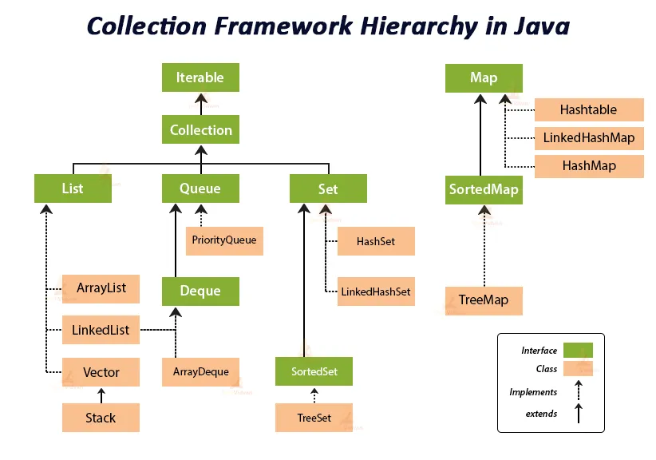

# Java Collection Framework
> 우리 스터디는 자바 자료 구조에 대해서 공부해요.  
> JUnit 5 을 이용해서 TDD(또는 BDD) 방식으로 진행해요.

## 시작
그냥 영상으로 대체 할게요.

## 진행 방식

https://techvidvan.com/tutorials/java-collection-framework/ 여기서 가져 왔어요.  
아주 훌륭한 분 이시더군요.  ~~이미지 가져왔으니까 이정도 공치사 쯤~~

여기 나온 계층 구조를 하나하나 테스트 해 볼 생각이에요.

## Check List
- setup  
  - [X] VS Code  
  - [X] Maven Starter Project  
  - [X] JUnit 5 dependency
---
- Iterable &lt;&lt;interface>>
  - Collection &lt;&lt;interface>>
    -  Set &lt;&lt;interface>>
      - [ ] HashSet
      - [ ] LinkedHashSet
      - [ ] SortedSet &lt;&lt;interface>>
        - [ ] TreeSet
    -  List &lt;&lt;interface>>
      - AbstractList
        - [X] ArrayList
        - [ ] LinkedList
        - [ ] Vector
          - [ ] Stack
    -  Queue &lt;&lt;interface>>
      -  Deque &lt;&lt;interface>>
        - [ ] ArrayDeque
      - [ ] PriorityQueue
- Map &lt;&lt;interface>>
  - [ ] Hashtable
  - [ ] LinkedHashMap
  - [ ] HashMap
  - SortedMap &lt;&lt;interface>>
    - [ ] TreeMap
